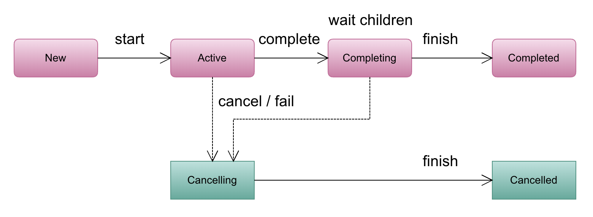

# 라이프 사이클과 에러 핸들링
비동기 함수를 다음과 같이 두 그룹으로 나눠볼 수 있다.

## 결과가 없는 비동기 함수
일반적인 상황으로는 데이터를 전송하고, 저장하는 것과 같은 백그라운드 작업을 예로 들 수 있다.
완료 여부를 모니터링할 수 있지만 결과를 갖지 않는 백그라운드 작업이 해당 유형에 속한다.
## 결과를 반환하는 비동기 함수
예를 들면 비동기 함수가 API를 통하여 정보를 가져올 때 거의 대부분 해당 작업을 통해 정보를 반환하고자 할 것이다.

## Job
Job은 Fire and forget 작업이다.
이름에서 알 수 있듯이 한번 시작된 작업은 예외가 발생되지 않은한 대기하지 않는다.
```Kotlin
fun main(args: Array<String>) = runBlocking {
    val job = GlobalScope.launch {
        // Do background task here
    }
}
```

### 예외처리
```kotlin
fun main(args: Array<String>) = runBlocking {
    GlobalScope.launch {
        TODO("Not Implemented!0")
    }
    delay(500)
}
```
이렇게 작성하면 현재 스레드에 예외가 전파된다.

### 라이프사이클

* New: 존재하지만 아직 실행되지 않은 Job
* Active(활성): 실행 중인 Job. 일시 중단된 Job도 활성으로 간주된다.
* Completed(완료 됨): Job이 더 이상 실행되지 않는 경우
* Canceling(취소 중): 실행 중인 Job에서 cancel()이 호출되면 취소가 되기까지 시간이 걸릴 수 있다.(추후에 나옴) 그래서 활성과 취소 사이의 중간이다.
* Cancelled(취소 됨): 취소로 인해 실행이 완료된 Job. 취소된 Job도 완료로 간주될 수 있다.

#### 생성
Job은 기본적으로 launch()나 Job()을 사용해 생성될 때 자동으로 시작 되지만, CoroutineStart.Lazy 옵션을 설정하여 자동으로 실행되지 않도록 할 수 있다.
```kotlin
fun main(args: Array<String>) = runBlocking {
    GlobalScope.launch(start = CoroutineStart.LAZY) {
        TODO("Not implemented yet!")
    }
    delay(500)
}
```
결과로는 Job은 생성이 된 상태이지만, 실행되지 않아 오류가 출력되지 않는다.

### 활성
생성 상태에 있는 Job은 다양한 방법으로 실작할 수 있지만 일반적으로 start()나 join()을 호출한다.
둘의 차이점으로는 start() 경우 시작 후 완료를 기다리지 않는 non-blocking 이고,
join()은 시작 후 결과를 기다리는 blocking 형태이다.
```kotlin
fun main(args: Array<String>) {
    val job = GlobalScope.launch(start = CoroutineStart.LAZY) {
        delay(3000)
    }
    job.start()
}
```
결과로는 3초를 기다리지 않고 job이 완료되기전 프로그램이 종료 된다.
또한 start 함수는 실행을 일시 중단하지 않으므로 일반 함수에서도 호출이 가능하다.
```kotlin
fun main(args: Array<String>) = runBlocking {
    val job = GlobalScope.launch(start = CoroutineStart.LAZY) {
        delay(3000)
    }
    job.join()
}
```
join()은 실행을 일시 중단할 수 있으므로, 코루틴 혹은 일시 중단 함수에서 호출 해야한다.
따라서 runBlocking이 사용되고 있다.
또한 job의 결과를 기다린 후 프로그램이 종료된다.

### 취소중
취소 요청을 받은 활성 Job은 취소중이라고 하는 스테이징 상태로 들어갈 수 있다.
Job에 실행을 취소하도록 요청하려면 cancel() 함수를 호출 해야 한다.
```kotlin
fun main(args: Array<String>) = runBlocking {
    val job = GlobalScope.launch() {
        delay(5000)
    }
    delay(2000)
    job.cancel()
}
```
Job은 실행 후 2초 뒤에 취소된다.

```
추가적으로 책에는 내용이 없지만 보충하고 싶은 내용이 있다.
추후에 나오겠지만 일시 중한 함수는 CPS(Continuation Passing Style) 형태로 변환되어 실행된다.
그래서 일시 중단 함수는 CPS 형태의 일반 함수로 변경이 된다.
CPS에 의해서 함수에 재진입 할때 현재 작업이 취소중인지 체크하여 Job을 종료한다.
그래서 launch의 코루틴 빌더에 넘겨준 block이 일시 중단이 되지 않는 코드라면 모두 실행 후 종료될 수 있다.
정리하면, cancel()을 호출하면 바로 종료될 수도 아닐수도 있다.
```
또한 cancelAndJoin() 함수도 있다. 이름에서 알 수 있듯이, 실행 취소를 요청할 뿐만 아니라 취소가 완료될때까지 현재 코루틴을 일시 중단한다. 


### 취소됨
취소 또는 처리되지 않은 예외로 인해 실행이 종료된 Job은 취소됨으로 간주된다.
Job이 취소되면 getCancellationException() 함수를 통해 취소에 대한 정보를 얻을 수 있다.

```kotlin
fun main(args: Array<String>) = runBlocking {
    val job = GlobalScope.launch() {
        delay(5000)
    }
    
    delay(2000)
    job.cancel(cause = CancellationException("Tired of wating"))
    
    val cancellation = job.getCancellationException()
    println(cancellation.message) // Tired of wating
}
```

```kotlin
fun main(args: Array<String>) = runBlocking {
    val exceptionHandler = CoroutineExceptionHandler { _: CoroutineContext, throwable: Throwable ->
        println("Job Cancelled cause by ${throwable.message}") // Job Cancelled cause by ot implemented yet!
    }
    val job = GlobalScope.launch(exceptionHandler) {
        TODO("Not implemented yet!")
    }
    
    delay(2000)
}
```

```kotlin
fun main(args: Array<String>) = runBlocking {
    val job = GlobalScope.launch() {
        TODO("Not implemented yet!")
    }.invokeOnCompletion { cause ->
        cause?.let {
            println("Job Cancelled cause by ${it.message}") // Job Cancelled cause by ot implemented yet!
        }
    }
    
    delay(2000)
}
```

### 완료됨
실행이 중지된 Job은 완료됨으로 간주된다. 즉 실행이 정상적으로 종료 되었거나 취소 되었는지 또는 예외 때문에 종료되었는지 상관없이 적용된다.
이러한 이유로 취소됨 항목은 완료됨 하위 항목으로 간주된다.

### Job의 상태 확인
Job에는 상태가 많아서 외부에서 현재 상태를 파악하는 방법을 알아보자
